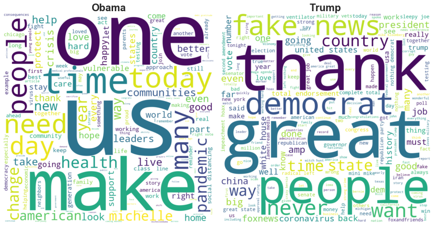

# Compare Presidential Responses to 2020 Events 

## Purpose
To look at how Obama and Trump respond online (via Twitter) to the events in 2020. This project was performed purely for educational purposes 

## Data 
Twitter data was scraped using GetOldsTweets3 : https://github.com/Mottl/GetOldTweets3 \
To install:\

```
pip install GetOldTweets3
```
Tweets from 1/1/20 to 6/1/20 were scraped from both Obama and Trump via:
```
GetOldTweets3 --username "barackobama" --since 2020-01-01 --until 2020-06-01
```
```
mv output_got.csv obama_2020.csv
```
<br>

```
GetOldTweets3 --username "realdonaldtrump" --since 2020-01-01 --until 2020-06-01
```
```
mv output_got.csv trump_2020.csv
```

## Cleaning 
Data was cleaned used the NLTK library. Stop words were removed. Words were not stemmed for clarity in word cloud 

## Result 


There is a clear difference in how each president is responding to 2020. I will let you decide which is better...


## Next Steps: 
An interesting next step is to perform Sentiment Analysis to interpret the message each President conveys in their response

## Disclaimer: 
This project was performed 100% for educational purposes. 
